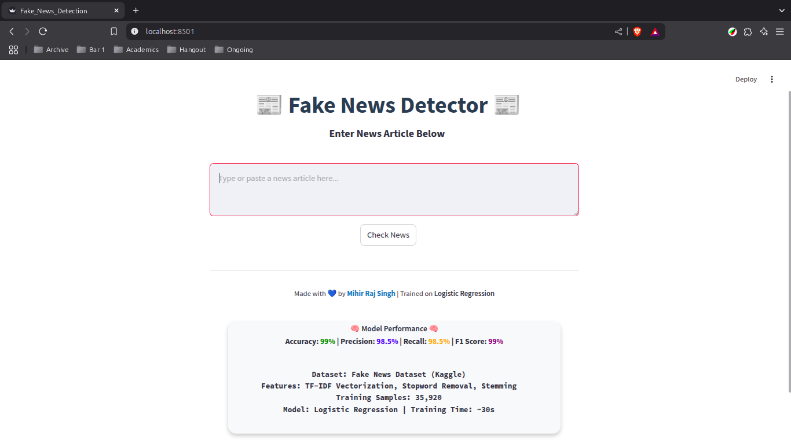

# Fake News Detection with Machine Learning


### 🚨 Deployment: [View Live](https://iammihirsig-fake-news-detector.streamlit.app/)

## Table of Contents
- [About](#about)
- [Features](#features)
- [Tech Stack](#tech-stack)
- [Model Performance](#model-performance)
- [Screenshots](#screenshots)
- [Videos](#videos)
- [What I Learned](#what-i-learned)
- [Getting Started](#getting-started)
- [Contributing](#contributing)
- [License](#license)

## 📖 About
This project is a **Fake News Detection System** that uses **Logistic Regression** to classify news articles as **Fake or Real**. The model is trained on a dataset of true and fake news articles and deployed using **Streamlit** for a user-friendly web interface.

## 🎯 Features
- ✅ User-friendly **Streamlit** interface
- ✅ Detects fake news using **Logistic Regression**
- ✅ Text preprocessing: **TF-IDF Vectorization, Stopword Removal, Stemming**
- ✅ **Accuracy**: 99% on test data
- ✅ Deployed for live testing

## 🏗️ Tech Stack
- **Python** (First Python project 🎉)
- **Machine Learning**: Scikit-learn, Logistic Regression
- **NLP**: TF-IDF Vectorizer, Regular Expressions
- **Frontend**: Streamlit, HTML, CSS
- **Deployment**: Streamlit Cloud

## 📊 Model Performance
| Metric     | Score |
|------------|------|
| Accuracy   | **99%**  |
| Precision  | **98.5%** |
| Recall     | **98.5%** |
| F1 Score   | **99%** |
| Training Time | **~30 sec** |


## 🖼️ Screenshots



## 🖼️ Videos
<video width="100%" controls>
  <source src="./resources/videos/FakeNewsDetection.mp4" type="video/mp4">
  Your browser does not support the video tag.
</video>

## 🎓 What I Learned
This was my **first Python project**, and I learned:
- **Data preprocessing** techniques for NLP
- **Building and training** an ML model
- **Deploying** a Streamlit app
- **Version control** with GitHub

## 🏗️ Getting Started
### 📂 Project Structure
```
├── .git/                    # Git repository
├── .gitignore               # Ignore unnecessary files
├── .streamlit/              # Streamlit configuration directory
├── .venv/                   # Virtual environment (excluded from Git)
├── resources/               # Contains screenshots and videos
├── app.ipynb                # Jupyter Notebook with training code
├── Fake.csv                 # Fake news dataset
├── True.csv                 # Real news dataset
├── Fake_News_Detection.py   # Main Streamlit app
├── LICENSE                  # MIT License
├── lr_model.jb              # Trained Logistic Regression model
├── Readme.md                # Project Documentation
├── Requirements.txt         # Dependencies
└── vectorizer.jb            # TF-IDF Vectorizer
```

### 🚀 How to Run
```bash
pip install -r Requirements.txt
streamlit run Fake_News_Detection.py
```

## 🤝 Contributing
I am not looking for contributions at this time. However, you are welcome to fork this repository and practice yourself to enhance your skills. Please avoid making unnecessary pull requests.

## 📜 License
This project is licensed under the **MIT License**. See the [LICENSE](LICENSE) file for details.

---
Crafted with 💙 by Mihir Raj Singh | GitHub: [iammihirsig](https://github.com/iammihirsig)
